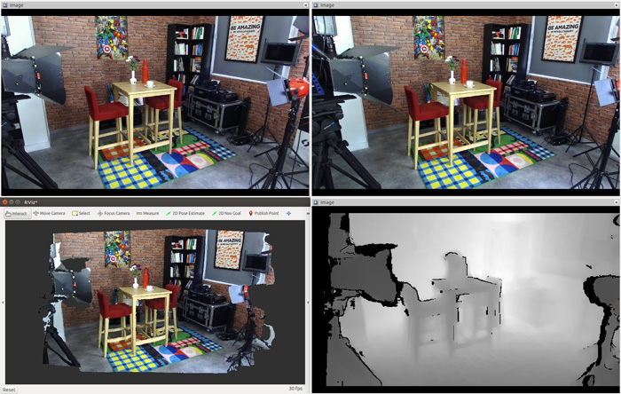
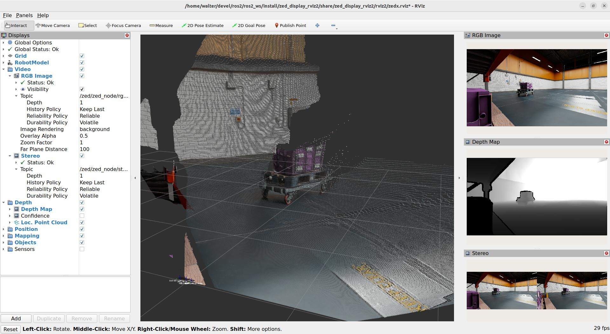
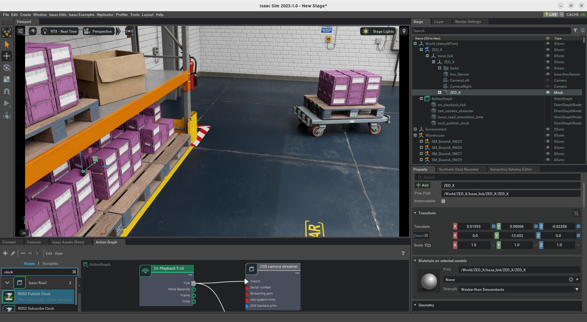
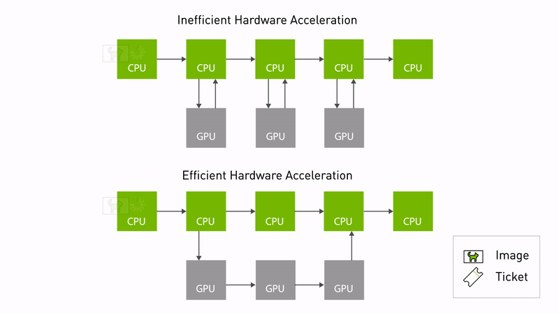

<h1 align="center">
   <br \>
   ROS 2 包装器
</h1>

<p align="center">
  适用于 Stereolabs ZED 相机的 ROS 2 功能包。<br>
  ROS 2 Foxy Fitzroy（Ubuntu 20.04）- ROS 2 Humble Hawksbill（Ubuntu 22.04）- ROS 2 Jazzy Jalisco（Ubuntu 24.04）
</p>

<hr>

本包用于在 ROS 2 中使用 ZED 相机，提供多种数据类型，包括：

- 彩色与灰度图像（校正/未校正）
- 深度数据
- 带颜色的 3D 点云
- 定位与建图（可选 GNSS 融合）
- 传感器数据
- 目标检测结果
- 人体骨架数据
- 等更多功能...

[更多信息](https://www.stereolabs.com/docs/ros2)



## 安装

### 前置条件

- [Ubuntu 20.04 (Focal Fossa)](https://releases.ubuntu.com/focal/)、[Ubuntu 22.04 (Jammy Jellyfish)](https://releases.ubuntu.com/jammy/) 或 [Ubuntu 24.04 (Noble Numbat)](https://releases.ubuntu.com/noble/)
- [ZED SDK](https://www.stereolabs.com/developers/release/latest/) v5.2（若需旧版本支持，请查看 [releases](https://github.com/stereolabs/zed-ros2-wrapper/releases)）
- [CUDA](https://developer.nvidia.com/cuda-downloads) 依赖
- ROS 2 Foxy Fitzroy（已弃用）、ROS 2 Humble Hawksbill 或 ROS 2 Jazzy Jalisco：
  - [Ubuntu 20.04 上的 Foxy](https://docs.ros.org/en/foxy/Installation/Linux-Install-Debians.html) [**不推荐，已 EOL**]
  - [Ubuntu 22.04 上的 Humble](https://docs.ros.org/en/humble/Installation/Linux-Install-Debians.html) [EOL：2027 年 5 月]
  - [Ubuntu 24.04 上的 Jazzy](https://docs.ros.org/en/jazzy/Installation/Linux-Install-Debians.html) [EOL：2029 年 5 月]

> 📝 **讲解注释：**
> - 推荐优先使用 **Humble/Jazzy**，Foxy 已停止维护。
> - ZED SDK 与 CUDA 版本匹配很关键，版本不一致常导致编译/运行失败。

### 构建包

**zed_ros2_wrapper** 是一个 [colcon](http://design.ros2.org/articles/build_tool.html) 包。

> :pushpin: **说明：** 如果你还没有配置 colcon 工作空间，请先参考这个简短[教程](https://index.ros.org/doc/ros2/Tutorials/Colcon-Tutorial/)。

安装 **zed_ros2_wrapper**，打开终端并执行：

```bash
mkdir -p ~/ros2_ws/src/ # 若工作空间不存在则创建
cd ~/ros2_ws/src/ # 进入你的 ROS 2 工作空间 src 目录
git clone https://github.com/stereolabs/zed-ros2-wrapper.git
cd ..
sudo apt update
rosdep update
rosdep install --from-paths src --ignore-src -r -y # 安装依赖
colcon build --symlink-install --cmake-args=-DCMAKE_BUILD_TYPE=Release --parallel-workers $(nproc) # 编译工作空间
echo source $(pwd)/install/local_setup.bash >> ~/.bashrc # 可选：每次新终端自动 source
source ~/.bashrc
```

> 📝 **讲解注释：**
> - `rosdep install` 会自动解析并安装 ROS 依赖。
> - `--symlink-install` 便于开发调试（修改脚本/配置后通常无需重新完整编译）。
> - `--parallel-workers $(nproc)` 使用所有 CPU 核心加速编译。

> :pushpin: **说明：** 依赖 `zed_msgs` 不再作为本仓库子模块安装；在 ROS 2 Humble 下可通过 `apt` 安装二进制包。若使用 Foxy 或其他发行版，可从 [zed-ros2-interfaces 仓库](https://github.com/stereolabs/zed-ros2-interfaces?tab=readme-ov-file#install-the-package-from-the-source-code)源码安装。

> :pushpin: **说明：** 若缺少 `rosdep`，可安装：
>
> `sudo apt-get install python3-rosdep python3-rosinstall-generator python3-vcstool python3-rosinstall build-essential`

> :pushpin: **说明：** `zed_debug` 包仅用于内部开发；如果不需要，可在 `colcon` 命令中添加 `--packages-skip zed_debug` 跳过编译。

> :pushpin: **说明：** 在 NVIDIA Jetson（JP6）上首次编译可能出现如下错误：
>
> ```bash
> CMake Error at /usr/share/cmake-3.22/Modules/FindCUDA.cmake:859 (message):
>   Specify CUDA_TOOLKIT_ROOT_DIR
> Call Stack (most recent call first):
>  /usr/local/zed/zed-config.cmake:72 (find_package)
>  CMakeLists.txt:81 (find_package)
> ```
>
> 可通过安装缺失的 `nvidia-jetpack` 包修复：
>
> `sudo apt install nvidia-jetpack nvidia-jetpack-dev`

> :pushpin: **说明：** `--symlink-install` 非常重要。ROS 2 包安装时通常会复制文件到 install 目录；启用软链接后，对“无需编译”的文件（Python、配置等）直接修改即可在下次运行生效，无需重新 `colcon build`。

> :pushpin: **说明：** 如果你使用 zsh，请改为：
> `echo source $(pwd)/install/local_setup.zsh >> ~/.zshrc`，然后 `source ~/.zshrc`。

## 启动 ZED 节点

> :pushpin: **说明：** 建议先阅读这份 [ROS 2 调优指南](https://www.stereolabs.com/docs/ros2/dds_and_network_tuning)，可改善 ZED 在 ROS 2 下的通信与性能。

启动命令：

```bash
ros2 launch zed_wrapper zed_camera.launch.py camera_model:=<camera_model>
```

将 `<camera_model>` 替换为你的相机型号：  
`'zed'`, `'zedm'`, `'zed2'`, `'zed2i'`, `'zedx'`, `'zedxm'`, `'zedxhdrmini'`, `'zedxhdr'`, `'zedxhdrmax'`, `'virtual'`, `'zedxonegs'`, `'zedxone4k'`, `'zedxonehdr'`。

`zed_camera.launch.py` 是 Python launch 脚本，使用“手动组合”（["manual composition"](https://index.ros.org/doc/ros2/Tutorials/Composition/)）自动启动 ZED 节点，并按相机型号加载对应 YAML 参数。  
同时会启动 Robot State Publisher，发布与该相机 URDF 模型匹配的静态链接与关节。

> :pushpin: **说明：** 你可以在 `zed_wrapper/config` 下修改配置文件：
> **common_stereo.yaml**、**zed.yaml**、**zedm.yaml**、**zed2.yaml**、**zed2i.yaml**、**zedx.yaml**、**zedxm.yaml**、**common_mono.yaml**、**zedxonegs.yaml**、**zedxone4k.yaml**、**zedxonehdr.yaml**。

查看全部可用 launch 参数：

```bash
ros2 launch zed_wrapper zed_camera.launch.py -s
ros2 launch zed_display_rviz2 display_zed_cam.launch.py -s
```

参数完整说明见[文档](https://www.stereolabs.com/docs/ros2/zed_node#configuration-parameters)。

### RViz 可视化

可在 [`zed-ros2-examples` 仓库](https://github.com/stereolabs/zed-ros2-examples/tree/master/zed_display_rviz2)使用预配置 RViz 环境，查看各类 ZED 数据与高级示例（深度、点云、里程计、目标检测等）。

也可快速验证深度数据：

```bash
rviz2 -d ./zed_wrapper/config/rviz2/<your camera model>.rviz
```

> 📝 **讲解注释：** RViz 会订阅大量话题，可能降低整体运行性能。性能测试建议在不启 RViz 时进行。

### 仿真模式

> :pushpin: **说明：** 此功能不兼容 ZED X One 和第一代旧款 ZED 相机。

使用仿真输入启动独立 ZED ROS 2 节点：

```bash
ros2 launch zed_wrapper zed_camera.launch.py camera_model:=zedx sim_mode:=true
```

启动参数：

- [必选] `camera_model`：仿真相机型号，必须与仿真设备一致。
- [必选] `sim_mode`：若为 `true`，以仿真模式启动。
- [可选] `use_sim_time`：等待 `/clock` 有效消息并使用仿真时钟。
- [可选] `sim_address`：仿真服务器地址，默认 `127.0.0.1`（同机部署常用）。
- [可选] `sim_port`：仿真服务器端口，需与 `ZED camera streamer` 节点的 `Streaming Port` 一致。多相机仿真时，每个相机需不同端口。

也可直接启动带可视化的预配置 RViz：

```bash
ros2 launch zed_display_rviz2 display_zed_cam.launch.py camera_model:=zedx sim_mode:=true
```

`display_zed_cam.launch.py` 内部包含了 `zed_camera.launch.py`，因此参数一致可复用。





支持的仿真环境：

- [NVIDIA Omniverse Isaac Sim](https://www.stereolabs.com/docs/isaac-sim/)

## 更多功能

### Point Cloud Transport（点云传输）

ZED ROS 2 Wrapper 支持 [Point Cloud Transport](http://wiki.ros.org/point_cloud_transport)，可用不同压缩方式发布点云。

仅当 ROS 2 环境中安装了 `point_cloud_transport` 包时可用；否则会自动禁用。

安装命令：

```bash
sudo apt install ros-$ROS_DISTRO-point-cloud-transport ros-$ROS_DISTRO-point-cloud-transport-plugins
```

:pushpin: **说明：** `point_cloud_transport` 不再是强制依赖，以避免所有环境都必须安装；如需该特性请手动安装。

### SVO 录制

节点运行时可通过服务 `start_svo_recording` 与 `stop_svo_recording` 启停 [SVO 录制](https://www.stereolabs.com/docs/video/recording/)。  
[更多信息](https://www.stereolabs.com/docs/ros2/zed_node/#services)

### 目标检测（Object Detection）

> :pushpin: **说明：** 此功能不兼容 ZED X One 和第一代旧款 ZED 相机。

可在启动时自动启用：在 `common_stereo.yaml` 中将 `object_detection/od_enabled` 设为 `true`。  
也可运行中通过服务 `enable_obj_det` 手动启停。

详细说明见[文档](https://www.stereolabs.com/docs/ros2/object-detection)。

### 使用 YOLO-like ONNX 的自定义目标检测

> :pushpin: **说明：** 此功能不兼容 ZED X One 和第一代旧款 ZED 相机。

可使用 YOLO-like ONNX 格式模型进行自定义推理。

安装 Ultralytics YOLO 工具：

```bash
python -m pip install ultralytics
```

已安装可升级：

```bash
pip install -U ultralytics
```

导出 ONNX（示例）：

```bash
yolo export model=yolo11n.pt format=onnx simplify=True dynamic=False imgsz=640
```

自训练模型示例：

```bash
yolo export model=yolov8l_custom_model.pt format=onnx simplify=True dynamic=False imgsz=512
```

详情见 [Ultralytics 文档](https://github.com/ultralytics/ultralytics)。

修改 `common_stereo.yaml`：

- 将 `object_detection.model` 设为 `CUSTOM_YOLOLIKE_BOX_OBJECTS`

并根据实际情况调整 `custom_object_detection.yaml`。

> :pushpin: **说明：** 首次使用自定义模型时，ZED SDK 会针对当前 GPU 执行优化，可能耗时数分钟。Docker 场景建议使用宿主机共享卷保存优化结果，避免重复优化。

优化期间日志示例：

```bash
[zed_wrapper-3] [INFO] [1729184874.634985183] [zed.zed_node]: === Starting Object Detection ===
[zed_wrapper-3] [2024-10-17 17:07:55 UTC][ZED][INFO] Please wait while the AI model is being optimized for your graphics card
[zed_wrapper-3]  This operation will be run only once and may take a few minutes 
```

详细说明见[文档](https://www.stereolabs.com/docs/ros2/custom-object-detection)。

### 人体跟踪（Body Tracking）

> :pushpin: **说明：** 此功能不兼容 ZED X One 和第一代旧款 ZED 相机。

可在启动时自动启用：在 `common_stereo.yaml` 中将 `body_tracking/bt_enabled` 设为 `true`。

### 空间建图（Spatial Mapping）

> :pushpin: **说明：** 此功能不兼容 ZED X One 相机。

可在启动时自动启用：在 `common_stereo.yaml` 中将 `mapping/mapping_enabled` 设为 `true`。  
也可运行中通过服务 `enable_mapping` 手动启停。

### GNSS 融合

> :pushpin: **说明：** 此功能不兼容 ZED X One 相机。

ZED ROS 2 Wrapper 可订阅 `NavSatFix` 话题，并将 GNSS 信息与视觉定位融合，得到以地球坐标为参考的精准定位。  
启用方式：设置 `gnss_fusion.gnss_fusion_enabled` 为 `true`。  
启动时需设置正确 `gnss_frame`，例如：`gnss_frame:='gnss_link'`。  
服务 `toLL` 和 `fromLL` 可在经纬度与机器人 `map` 坐标之间转换。

### 2D 模式

> :pushpin: **说明：** 此功能不兼容 ZED X One 相机。

对于平面运动机器人，可启用 2D 模式（`common_stereo.yaml` 中 `pos_tracking/two_d_mode`）。  
里程计与位姿中的 Z 坐标固定为 `pos_tracking/fixed_z_value`；Roll/Pitch 与对应速度固定为 0。

## NVIDIA® Isaac ROS 集成

ZED ROS 2 Wrapper 与 [NVIDIA® Isaac ROS](https://nvidia-isaac-ros.github.io/) 兼容。  
该框架为 NVIDIA 平台机器人应用提供工具与库。

本包装器可利用 [NITROS](https://nvidia-isaac-ros.github.io/concepts/nitros/index.html)（NVIDIA® Isaac Transport for ROS）在 NVIDIA 加速 ROS 图中实现高效数据流。



请阅读完整 [Isaac ROS 集成指南](https://docs.stereolabs.com/isaac-ros/)，了解如何配置开发环境。

## 示例与教程

为帮助理解与集成，示例与教程位于 [`zed-ros2-examples` 仓库](https://github.com/stereolabs/zed-ros2-examples)。

### RVIZ2 可视化示例

- 预配置 RViz 启动文件（显示 ZED Wrapper 节点全部信息）：[zed_display_rviz2](https://github.com/stereolabs/zed-ros2-examples/tree/master/zed_display_rviz2)
- ZED2 的 ROS 2 RViz 插件（显示目标检测框与骨架）：[rviz-plugin-zed-od](https://github.com/stereolabs/zed-ros2-examples/tree/master/rviz-plugin-zed-od)

### 教程

- [视频订阅](https://github.com/stereolabs/zed-ros2-examples/tree/master/tutorials/zed_video_tutorial)：`zed_video_tutorial`  
  学习编写节点订阅 `sensor_msgs/Image`，获取左右校正图像。
- [深度订阅](https://github.com/stereolabs/zed-ros2-examples/tree/master/tutorials/zed_depth_tutorial)：`zed_depth_tutorial`  
  学习订阅深度图并读取图像中心测距值。
- [位姿/里程计订阅](https://github.com/stereolabs/zed-ros2-examples/tree/master/tutorials/zed_pose_tutorial)：`zed_pose_tutorial`  
  学习订阅 `geometry_msgs/PoseStamped` 与 `nav_msgs/Odometry`。
- [ROS 2 Composition + BGRA2BGR 转换](https://github.com/stereolabs/zed-ros2-examples/tree/master/tutorials/zed_rgb_convert)：`zed_rgb_convert`  
  学习通过组件与进程内通信实现图像通道转换。
- [ROS 2 多相机](https://github.com/stereolabs/zed-ros2-examples/tree/master/tutorials/zed_multi_camera)：`zed_multi_camera`  
  学习启动多相机机器人配置。
- [ROS 2 多相机 + 进程内通信](https://github.com/stereolabs/zed-ros2-examples/tree/master/tutorials/zed_ipc)：`zed_ipc`  
  学习在同一进程加载处理节点，利用 ROS 2 进程内通信优化性能。
- [机器人集成](https://github.com/stereolabs/zed-ros2-examples/tree/master/tutorials/zed_robot_integration)：`zed_robot_integration`  
  学习将一个或多个 ZED 相机集成进机器人系统。

### 示例

展示如何将 ZED ROS 2 节点与其他 ROS 2 包或高级特性联合使用：

- [zed_aruco_localization](https://github.com/stereolabs/zed-ros2-examples/tree/master/examples/zed_aruco_localization)：使用已定位 ArUco 标签作为定位参考。
- [zed_depth_to_laserscan](https://github.com/stereolabs/zed-ros2-examples/tree/master/examples/zed_depth_to_laserscan)：将 ZED 深度图转换为虚拟激光扫描数据。

## 更新本地仓库

更新到最新版本（拉取 `zed-ros2-wrapper` 最新提交）：

```bash
git checkout master # 若当前不在主分支
git pull
```

重新编译前建议清理 colcon 缓存：

```bash
cd <ros2_workspace_root> # 替换为你的工作空间根目录，例如 ~/ros2_ws/
rm -r install
rm -r build
rm -r log
colcon build --symlink-install --cmake-args=-DCMAKE_BUILD_TYPE=Release --parallel-workers $(nproc)
```

> 📝 **讲解注释：** 清理 `build/install/log` 可避免旧缓存引发的“编译成功但运行异常”问题。

## 已知问题

- 暂无可报告问题。

如果你发现 Bug 或希望新增功能，请在 [GitHub Issues](https://github.com/stereolabs/zed-ros2-wrapper/issues) 提交问题。